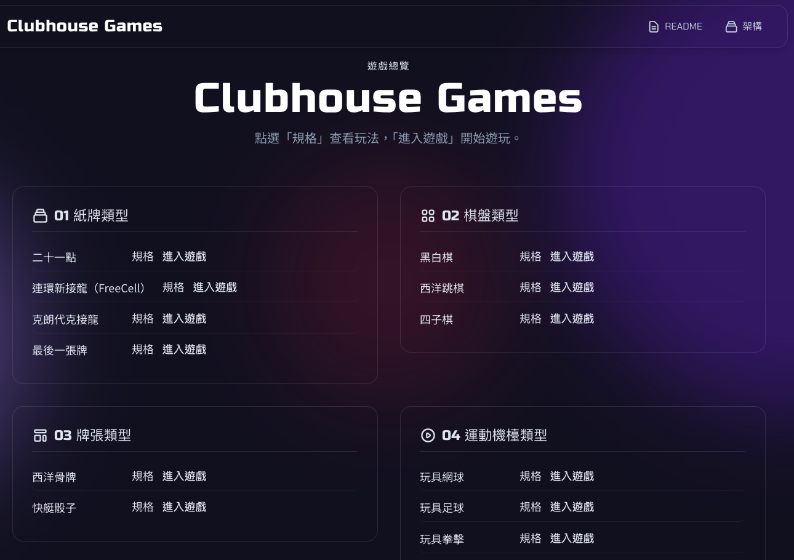

# Clubhouse Games — Game Specifications Overview



This project collects specification and gameplay documents for each game, for use in subsequent development. Game implementations live under `Games/` and are accessible via the **Game Overview Menu**, with deployment on GitHub Pages.

- **Game Overview Menu**: [index.html](index.html) (site homepage; select a game to enter)
- **Architecture and Deployment**: [docs/PROJECT-STRUCTURE.md](docs/PROJECT-STRUCTURE.md) (document structure, Games folder conventions)
- **GitHub Pages Build and Deployment**: [docs/DEPLOYMENT.md](docs/DEPLOYMENT.md) (build process, CI, local build:pages)
- **Implemented examples**: Blackjack → [Games/Blackjack-main/](Games/Blackjack-main/); FreeCell → [Games/FreeCell/](Games/FreeCell/); Last Card → [Games/Last-Card/](Games/Last-Card/); Klondike → [Games/Klondike/](Games/Klondike/); Block the Smash → [Games/Block-the-smash/](Games/Block-the-smash/); Instant Flash → [Games/Instant-Flash/](Games/Instant-Flash/); Mystery Liquid Sort → [Games/Mystery-Liquid-Sort/](Games/Mystery-Liquid-Sort/)

### Local Development (Single Server)

Only **one** development server is started; the menu and all built games are served from the same port.

1. Install dependencies in the project root (sub-projects need to be installed separately):
   ```bash
   npm install
   cd Games/Blackjack-main && npm install && cd ../..
   cd Games/Mystery-Liquid-Sort && npm install && cd ../..
   ```
2. Build the game(s) you want to play (e.g. Blackjack or Mystery Liquid Sort):
   ```bash
   npm run build:game Blackjack-main
   # or
   npm run build:game Mystery-Liquid-Sort
   ```
3. Start the server:
   ```bash
   npm run dev
   ```
4. Open **http://localhost:3000**: you will see the overview menu; click "Enter Game" to open a built game (e.g. Blackjack).

New games are also built first with `npm run build:game <folder-name>`, then entered from the menu—you do not need to run 51 separate services.

## Directory Structure

<!-- GENERATED_TABLE -->
| Category | Folder | Count |
|----------|--------|-------|
| Card Games | [01-cards/](01-cards/) | 4 |
| Board Games | [02-board/](02-board/) | 3 |
| Tiles & Dice | [03-tiles-dice/](03-tiles-dice/) | 2 |
| Sports & Arcade | [04-sports-arcade/](04-sports-arcade/) | 5 |
| Puzzle | [05-puzzle/](05-puzzle/) | 3 |
| Minigames | [06-minigames/](06-minigames/) | 5 |
<!-- /GENERATED_TABLE -->

# Clubhouse Games

<!-- GENERATED_GAMES_CHECKLIST -->
## 01 — Card Games
- [x] [Blackjack](01-cards/blackjack.md) → [Games/Blackjack-main/](Games/Blackjack-main/)
- [x] [FreeCell](01-cards/freecell.md) → [Games/FreeCell/](Games/FreeCell/)
- [x] [Klondike](01-cards/klondike.md) → [Games/Klondike/](Games/Klondike/)
- [x] [Last Card](01-cards/last-card.md) → [Games/Last-Card/](Games/Last-Card/)

## 02 — Board Games
- [x] [Reversi](02-board/reversi.md) → [Games/Reversi/](Games/Reversi/)
- [x] [Checkers](02-board/checkers.md) → [Games/Checkers/](Games/Checkers/)
- [x] [Connect Four](02-board/connect-four.md) → [Games/Connect-Four/](Games/Connect-Four/)

## 03 — Tiles & Dice
- [x] [Dominoes](03-tiles-dice/dominoes.md) → [Games/Dominoes/](Games/Dominoes/)
- [x] [Yahtzee](03-tiles-dice/yahtzee.md) → [Games/Yahtzee/](Games/Yahtzee/)

## 04 — Sports & Arcade
- [x] [Toy Tennis](04-sports-arcade/toy-tennis.md) → [Games/Toy-Tennis/](Games/Toy-Tennis/)
- [x] [Toy Football](04-sports-arcade/toy-football.md) → [Games/Toy-Football/](Games/Toy-Football/)
- [x] [Toy Boxing](04-sports-arcade/toy-boxing.md) → [Games/Toy-Boxing/](Games/Toy-Boxing/)
- [x] [Toy Baseball](04-sports-arcade/toy-baseball.md) → [Games/Toy-Baseball/](Games/Toy-Baseball/)
- [x] [Block the Smash](04-sports-arcade/badminton-smash.md) → [Games/Block-the-smash/](Games/Block-the-smash/)

## 05 — Puzzle
- [x] [Mystery Liquid Sort](05-puzzle/mystery-liquid-sort.md) → [Games/Mystery-Liquid-Sort/](Games/Mystery-Liquid-Sort/)
- [x] [Takoyaki](05-puzzle/takoyaki.md) → [Games/Takoyaki/](Games/Takoyaki/)
- [x] [Tetris](05-puzzle/tetris.md) → [Games/Tetris/](Games/Tetris/)

## 06 — Minigames
- [x] [Pachinko](06-minigames/pachinko.md) → [Games/Pachinko/](Games/Pachinko/)
- [x] [Slot Cars](06-minigames/slot-cars.md) → [Games/Slot-Cars/](Games/Slot-Cars/)
- [x] [Guess the Color](06-minigames/guess-the-color.md) → [Games/Guess-the-Color/](Games/Guess-the-Color/)
- [x] [Tank Battle](06-minigames/tank-battle.md) → [Games/Tank-Battle/](Games/Tank-Battle/)
- [x] [Instant Flash](06-minigames/instant-flash.md) → [Games/Instant-Flash/](Games/Instant-Flash/)
<!-- /GENERATED_GAMES_CHECKLIST -->
