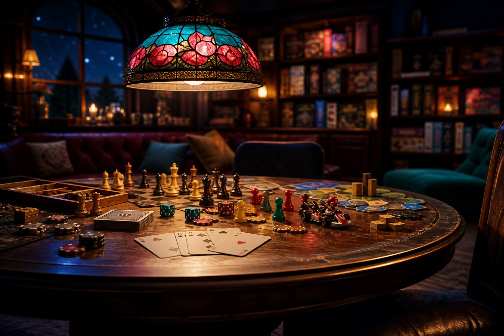

# Clubhouse Games — Game Specifications Overview



This project collects specification and gameplay documents for each game, for use in subsequent development. Game implementations live under `Games/` and are accessible via the **Game Overview Menu**, with deployment on GitHub Pages.

- **Game Overview Menu**: [index.html](index.html) (site homepage; select a game to enter)
- **Architecture and Deployment**: [docs/PROJECT-STRUCTURE.md](docs/PROJECT-STRUCTURE.md) (document structure, Games folder conventions)
- **GitHub Pages Build and Deployment**: [docs/DEPLOYMENT.md](docs/DEPLOYMENT.md) (build process, CI, local build:pages)
- **Implemented examples**: Blackjack → [Games/Blackjack-main/](Games/Blackjack-main/); FreeCell → [Games/FreeCell/](Games/FreeCell/); Klondike → [Games/Klondike/](Games/Klondike/); Block the Smash → [Games/Block-the-smash/](Games/Block-the-smash/); Instant Flash → [Games/Instant-Flash/](Games/Instant-Flash/); Mystery Liquid Sort → [Games/Mystery-Liquid-Sort/](Games/Mystery-Liquid-Sort/)

### Local Development (Single Server)

Only **one** development server is started; the menu and all built games are served from the same port.

1. Install dependencies once at the repo root (npm workspaces covers every game):
   ```bash
   npm run setup
   ```
2. Build the game(s) you want to play, or build all at once:
   ```bash
   npm run build:game Blackjack-main
   # or
   npm run build:all
   ```
3. Start the server:
   ```bash
   npm run dev
   ```
4. Open **http://localhost:3000**: you will see the overview menu; click "Enter Game" to open a built game (e.g. Blackjack).

New games are also built first with `npm run build:game <folder-name>`, then entered from the menu—you do not need to run 51 separate services.

## Directory Structure

<!-- GENERATED_TABLE -->
| 類別 | 資料夾 | 遊戲數 |
|------|--------|--------|
| 紙牌類型 | [01-cards/](01-cards/) | 4 |
| 棋盤類型 | [02-board/](02-board/) | 3 |
| 牌張類型 | [03-tiles-dice/](03-tiles-dice/) | 1 |
| 運動機檯類型 | [04-sports-arcade/](04-sports-arcade/) | 8 |
| 串聯拼砌類型 | [05-puzzle/](05-puzzle/) | 7 |
| 迷你遊戲類型 | [06-minigames/](06-minigames/) | 2 |
<!-- /GENERATED_TABLE -->

# Clubhouse Games

<!-- GENERATED_GAMES_CHECKLIST -->
## 01-紙牌遊戲
- [x] [二十一點](01-cards/blackjack.md) → [Games/Blackjack-main/](Games/Blackjack-main/)
- [x] [連環新接龍（FreeCell）](01-cards/freecell.md) → [Games/FreeCell/](Games/FreeCell/)
- [x] [克朗代克接龍](01-cards/klondike.md) → [Games/Klondike/](Games/Klondike/)
- [x] [花牌 Koi-Koi](01-cards/koi-koi.md) → [Games/Koi-Koi/](Games/Koi-Koi/)

## 02-棋盤遊戲
- [x] [黑白棋](02-board/reversi.md) → [Games/Reversi/](Games/Reversi/)
- [x] [西洋跳棋](02-board/checkers.md) → [Games/Checkers/](Games/Checkers/)
- [x] [四子棋](02-board/connect-four.md) → [Games/Connect-Four/](Games/Connect-Four/)

## 03-牌塊與骰子
- [x] [西洋骨牌](03-tiles-dice/dominoes.md) → [Games/Dominoes/](Games/Dominoes/)

## 04-運動與街機
- [x] [玩具拳擊](04-sports-arcade/toy-boxing.md) → [Games/Toy-Boxing/](Games/Toy-Boxing/)
- [x] [玩具棒球](04-sports-arcade/toy-baseball.md) → [Games/Toy-Baseball/](Games/Toy-Baseball/)
- [x] [羽毛球接殺訓練](04-sports-arcade/badminton-smash.md) → [Games/Block-the-smash/](Games/Block-the-smash/)
- [x] [積木賽車](04-sports-arcade/brick-kart-racing.md) → [Games/Brick-Kart-Racing/](Games/Brick-Kart-Racing/)
- [x] [海灣帆航](04-sports-arcade/sailing.md) → [Games/Sailing/](Games/Sailing/)
- [x] [霓虹疾馳](04-sports-arcade/cyber-neon-rush.md) → [Games/Cyber-Neon-Rush/](Games/Cyber-Neon-Rush/)
- [x] [棒球人生](04-sports-arcade/baseball-life.md) → [Games/Baseball-Life/](Games/Baseball-Life/)
- [x] [球團王朝](04-sports-arcade/dynasty.md) → [Games/Dynasty/](Games/Dynasty/)

## 05-益智遊戲
- [x] [神秘液體排序](05-puzzle/mystery-liquid-sort.md) → [Games/Mystery-Liquid-Sort/](Games/Mystery-Liquid-Sort/)
- [x] [俄羅斯方塊](05-puzzle/tetris.md) → [Games/Tetris/](Games/Tetris/)
- [x] [蛇窟迴廊（Roguelike 貪吃蛇）](05-puzzle/roguelike-snake.md) → [Games/Roguelike-Snake/](Games/Roguelike-Snake/)
- [x] [魔法氣泡](05-puzzle/puyo-puyo.md) → [Games/Puyo-Puyo/](Games/Puyo-Puyo/)
- [x] [發條守城](05-puzzle/clockwork-keep.md) → [Games/Clockwork-Keep/](Games/Clockwork-Keep/)
- [x] [數字推盤](05-puzzle/fifteen-puzzle.md) → [Games/Fifteen-Puzzle/](Games/Fifteen-Puzzle/)
- [x] [記憶配對](05-puzzle/memory-match.md) → [Games/Memory-Match/](Games/Memory-Match/)

## 06-迷你遊戲
- [x] [武士反應訓練](06-minigames/instant-flash.md) → [Games/Instant-Flash/](Games/Instant-Flash/)
- [x] [色感記憶](06-minigames/dialed-color.md) → [Games/Dialed-Color/](Games/Dialed-Color/)
<!-- /GENERATED_GAMES_CHECKLIST -->
