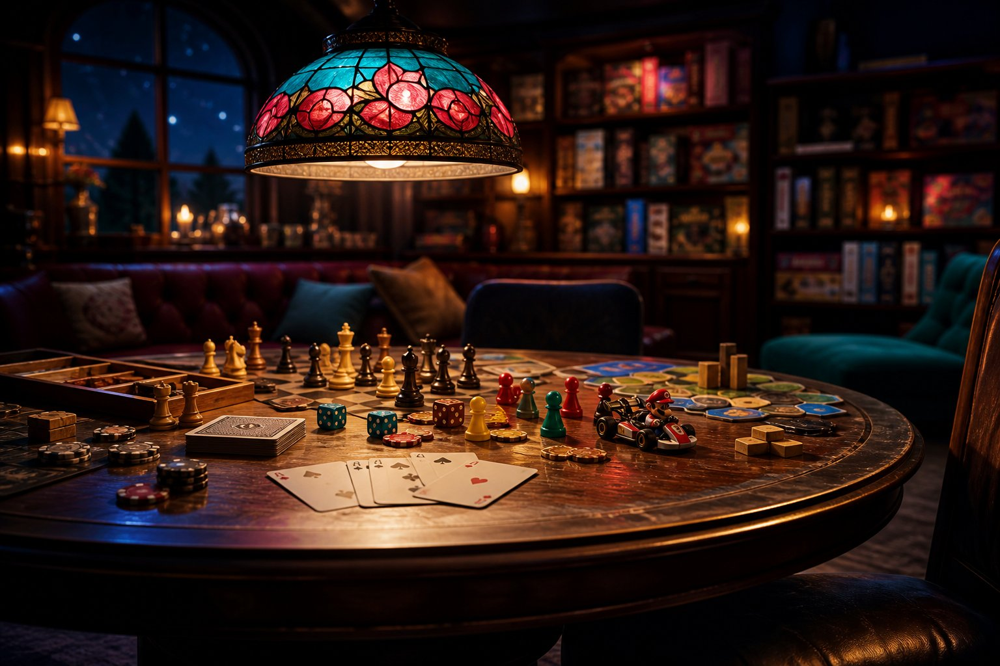

# Clubhouse Games — Game Specifications Overview



This project collects specification and gameplay documents for each game, for use in subsequent development. Game implementations live under `Games/` and are accessible via the **Game Overview Menu**, with deployment on GitHub Pages. GPT-6 / Astra one-shot demos live under `gpt6-astra/` and appear in the menu under **07 Astra**.

- **Game Overview Menu**: [index.html](index.html) (site homepage; select a game to enter)
- **Architecture and Deployment**: [docs/PROJECT-STRUCTURE.md](docs/PROJECT-STRUCTURE.md) (document structure, Games folder conventions)
- **GitHub Pages Build and Deployment**: [docs/DEPLOYMENT.md](docs/DEPLOYMENT.md) (build process, CI, local build:pages)
- **Astra gallery**: [gpt6-astra/](gpt6-astra/) (static one-shots; brief specs in [07-astra/](07-astra/))
- **Implemented examples**: Blackjack → [Games/Blackjack-main/](Games/Blackjack-main/); FreeCell → [Games/FreeCell/](Games/FreeCell/); Klondike → [Games/Klondike/](Games/Klondike/); Block the Smash → [Games/Block-the-smash/](Games/Block-the-smash/); Instant Flash → [Games/Instant-Flash/](Games/Instant-Flash/); Mystery Liquid Sort → [Games/Mystery-Liquid-Sort/](Games/Mystery-Liquid-Sort/)

### Local Development (Single Server)

Only **one** development server is started; the menu and all built games are served from the same port.

1. Install dependencies once at the repo root (npm workspaces covers every game):
   ```bash
   npm run setup
   ```
2. Build the game(s) you want to play, or build all at once:
   ```bash
   npm run build:game Blackjack-main
   # or
   npm run build:all
   ```
3. Start the server:
   ```bash
   npm run dev
   ```
4. Open **http://localhost:3000**: you will see the overview menu; click "Enter Game" to open a built game (e.g. Blackjack).

New games are also built first with `npm run build:game <folder-name>`, then entered from the menu—you do not need to run 51 separate services.

## Directory Structure

<!-- GENERATED_TABLE -->
| 類別 | 資料夾 | 遊戲數 |
|------|--------|--------|
| 紙牌類型 | [01-cards/](01-cards/) | 6 |
| 棋盤類型 | [02-board/](02-board/) | 3 |
| 牌張類型 | [03-tiles-dice/](03-tiles-dice/) | 1 |
| 運動機檯類型 | [04-sports-arcade/](04-sports-arcade/) | 10 |
| 串聯拼砌類型 | [05-puzzle/](05-puzzle/) | 8 |
| 迷你遊戲類型 | [06-minigames/](06-minigames/) | 3 |
| Astra 實驗 | [07-astra/](07-astra/) | 15 |
<!-- /GENERATED_TABLE -->

# Clubhouse Games

<!-- GENERATED_GAMES_CHECKLIST -->
## 01-紙牌遊戲
- [x] [二十一點](01-cards/blackjack.md) → [Games/Blackjack-main/](Games/Blackjack-main/)
- [x] [連環新接龍（FreeCell）](01-cards/freecell.md) → [Games/FreeCell/](Games/FreeCell/)
- [x] [克朗代克接龍](01-cards/klondike.md) → [Games/Klondike/](Games/Klondike/)
- [x] [花牌 Koi-Koi](01-cards/koi-koi.md) → [Games/Koi-Koi/](Games/Koi-Koi/)
- [x] [撿紅點](01-cards/pick-red.md) → [Games/Pick-Red/](Games/Pick-Red/)
- [x] [大老二](01-cards/big-two.md) → [Games/Big-Two/](Games/Big-Two/)

## 02-棋盤遊戲
- [x] [黑白棋](02-board/reversi.md) → [Games/Reversi/](Games/Reversi/)
- [x] [西洋跳棋](02-board/checkers.md) → [Games/Checkers/](Games/Checkers/)
- [x] [四子棋](02-board/connect-four.md) → [Games/Connect-Four/](Games/Connect-Four/)

## 03-牌塊與骰子
- [x] [西洋骨牌](03-tiles-dice/dominoes.md) → [Games/Dominoes/](Games/Dominoes/)

## 04-運動與街機
- [x] [玩具拳擊](04-sports-arcade/toy-boxing.md) → [Games/Toy-Boxing/](Games/Toy-Boxing/)
- [x] [玩具棒球](04-sports-arcade/toy-baseball.md) → [Games/Toy-Baseball/](Games/Toy-Baseball/)
- [x] [羽毛球接殺訓練](04-sports-arcade/badminton-smash.md) → [Games/Block-the-smash/](Games/Block-the-smash/)
- [x] [積木賽車](04-sports-arcade/brick-kart-racing.md) → [Games/Brick-Kart-Racing/](Games/Brick-Kart-Racing/)
- [x] [海灣帆航](04-sports-arcade/sailing.md) → [Games/Sailing/](Games/Sailing/)
- [x] [霓虹疾馳](04-sports-arcade/cyber-neon-rush.md) → [Games/Cyber-Neon-Rush/](Games/Cyber-Neon-Rush/)
- [x] [棒球人生](04-sports-arcade/baseball-life.md) → [Games/Baseball-Life/](Games/Baseball-Life/)
- [x] [球團王朝](04-sports-arcade/dynasty.md) → [Games/Dynasty/](Games/Dynasty/)
- [x] [彈幕深淵](04-sports-arcade/danmaku-abyss.md) → [Games/Danmaku-Abyss/](Games/Danmaku-Abyss/)
- [x] [岔道疾走](04-sports-arcade/switchpoint-run.md) → [Games/Switchpoint-Run/](Games/Switchpoint-Run/)

## 05-益智遊戲
- [x] [神秘液體排序](05-puzzle/mystery-liquid-sort.md) → [Games/Mystery-Liquid-Sort/](Games/Mystery-Liquid-Sort/)
- [x] [俄羅斯方塊](05-puzzle/tetris.md) → [Games/Tetris/](Games/Tetris/)
- [x] [蛇窟迴廊（Roguelike 貪吃蛇）](05-puzzle/roguelike-snake.md) → [Games/Roguelike-Snake/](Games/Roguelike-Snake/)
- [x] [魔法氣泡](05-puzzle/puyo-puyo.md) → [Games/Puyo-Puyo/](Games/Puyo-Puyo/)
- [x] [發條守城](05-puzzle/clockwork-keep.md) → [Games/Clockwork-Keep/](Games/Clockwork-Keep/)
- [x] [數字推盤](05-puzzle/fifteen-puzzle.md) → [Games/Fifteen-Puzzle/](Games/Fifteen-Puzzle/)
- [x] [記憶配對](05-puzzle/memory-match.md) → [Games/Memory-Match/](Games/Memory-Match/)
- [x] [走透透](05-puzzle/every-corner.md) → [Games/Every-Corner/](Games/Every-Corner/)

## 06-迷你遊戲
- [x] [武士反應訓練](06-minigames/instant-flash.md) → [Games/Instant-Flash/](Games/Instant-Flash/)
- [x] [色感記憶](06-minigames/dialed-color.md) → [Games/Dialed-Color/](Games/Dialed-Color/)
- [x] [幣潮](06-minigames/coin-cascade.md) → [Games/Coin-Cascade/](Games/Coin-Cascade/)

## 07-Astra（GPT-6）
- [x] [AI 智慧家庭](07-astra/webmcp-ai-smart-home.md) → [gpt6-astra/webmcp-ai-smart-home/](gpt6-astra/webmcp-ai-smart-home/)
- [x] [迷你電商](07-astra/webmcp-mini-amazon.md) → [gpt6-astra/webmcp-mini-amazon/](gpt6-astra/webmcp-mini-amazon/)
- [x] [迷你戰術地牢](07-astra/webmcp-mini-tactical-dungeon.md) → [gpt6-astra/webmcp-mini-tactical-dungeon/](gpt6-astra/webmcp-mini-tactical-dungeon/)
- [x] [迷你工廠](07-astra/webmcp-mini-factory.md) → [gpt6-astra/webmcp-mini-factory/](gpt6-astra/webmcp-mini-factory/)
- [x] [密室逃脫](07-astra/webmcp-escape-room.md) → [gpt6-astra/webmcp-escape-room/](gpt6-astra/webmcp-escape-room/)
- [x] [Agent 看板](07-astra/webmcp-agent-trello.md) → [gpt6-astra/webmcp-agent-trello/](gpt6-astra/webmcp-agent-trello/)
- [x] [披薩／漢堡組裝](07-astra/webmcp-pizza.md) → [gpt6-astra/webmcp-pizza/](gpt6-astra/webmcp-pizza/)
- [x] [魔術方塊](07-astra/webmcp-rubiks-cube.md) → [gpt6-astra/webmcp-rubiks-cube/](gpt6-astra/webmcp-rubiks-cube/)
- [x] [循環之路](07-astra/loop-hero.md) → [gpt6-astra/loop-hero/](gpt6-astra/loop-hero/)
- [x] [弓箭手](07-astra/archer.md) → [gpt6-astra/archer/](gpt6-astra/archer/)
- [x] [動力雕塑展](07-astra/exhibition-web.md) → [gpt6-astra/exhibition-web/](gpt6-astra/exhibition-web/)
- [x] [3D 航行](07-astra/3d-sailing.md) → [gpt6-astra/3d-sailing/](gpt6-astra/3d-sailing/)
- [x] [無盡火車](07-astra/train.md) → [gpt6-astra/train/](gpt6-astra/train/)
- [x] [3D 填空](07-astra/3d-fill-the-void.md) → [gpt6-astra/3d-fill-the-void/](gpt6-astra/3d-fill-the-void/)
- [x] [邊疆](07-astra/borderland.md) → [gpt6-astra/borderland/](gpt6-astra/borderland/)
<!-- /GENERATED_GAMES_CHECKLIST -->
